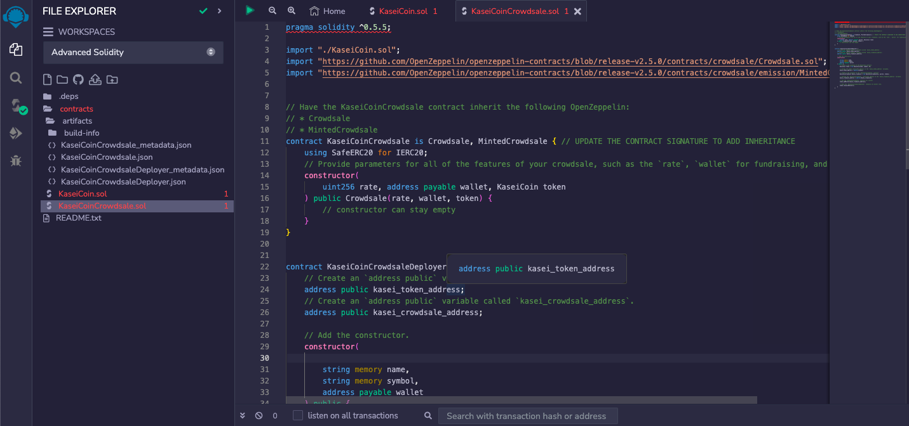
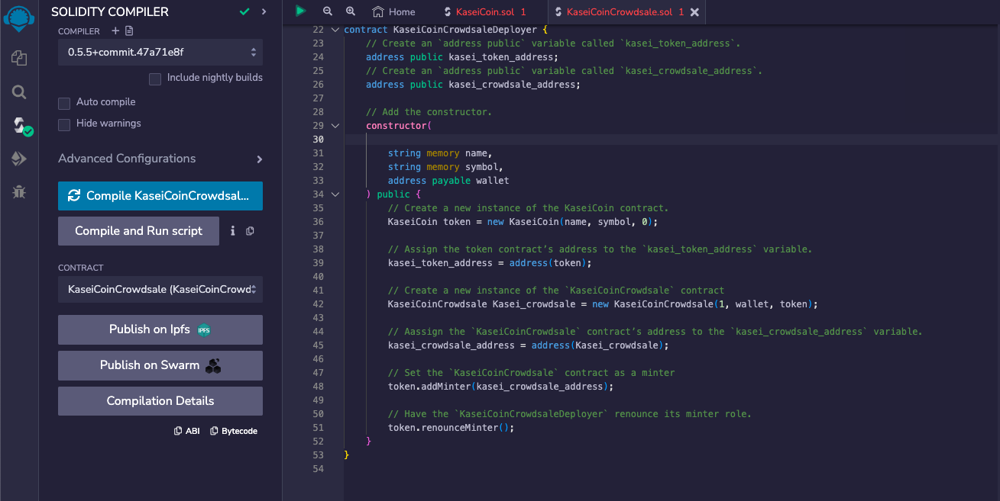
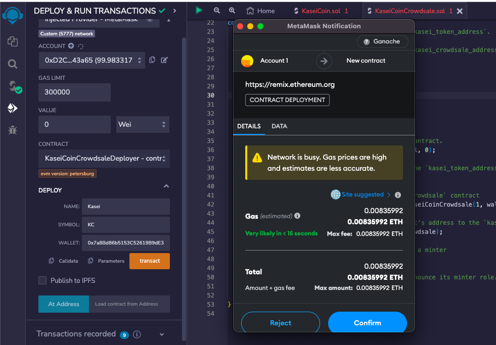
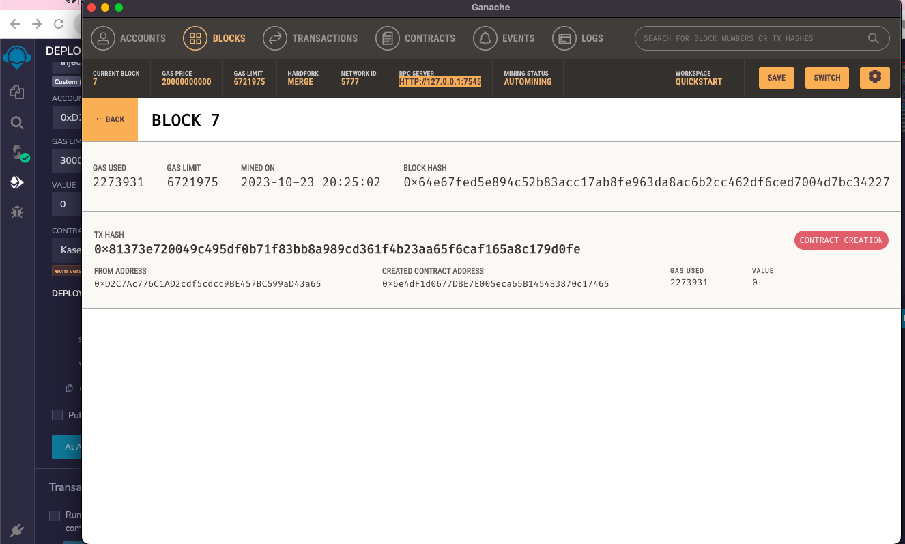
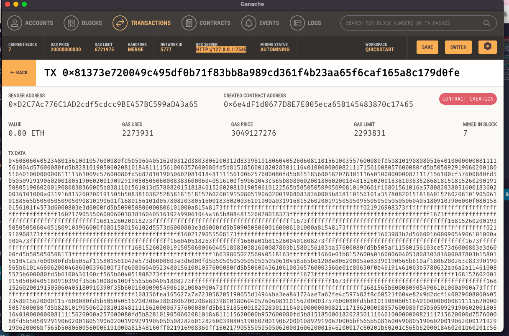

# Martian Token Crowdsale

## Background
Exploring new system on blockchain technology and to define a new cryptocurrency named **KaseiCoin**. (Kasei means Mars in Japanese.)
KaseiCoin will be a fungible token that’s ERC-20 compliant.

## Files

[KaseiCoin.sol](./KaseiCoin.sol)

[KaseiCoinCrowdsale.sol](./KaseiCoinCrowdsale.com)

## Steps taken

1. Contract creation

2. Compilation of contracts

3. Deploying the contract

